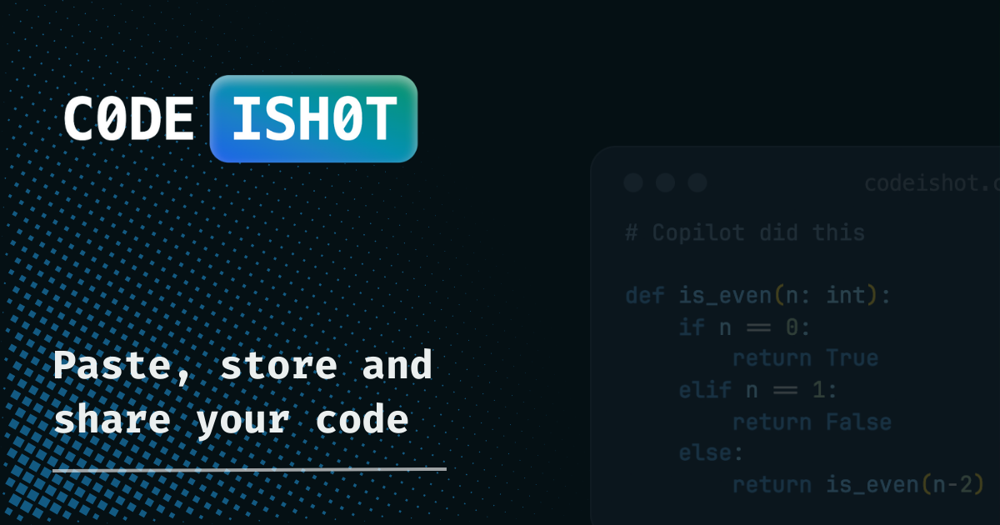
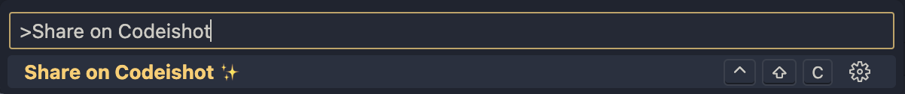

    
   

# Codeishot VSCode Extension

Codeishot is a Visual Studio Code extension designed to enhance the coding experience by allowing users to quickly share code snippets directly from the editor. It captures selected text, posts it to a local server, and provides a shareable URL to the user.

## Features

- **Snippet Sharing**: Easily share code snippets with a unique URL.
- **Clipboard Integration**: Automatically copies the snippet URL to the clipboard.
- **Error Handling**: Comprehensive error messages for a smooth user experience.
- **Language Support**: Language detection.
- **Codeishot Authentication**: Added login function to authenticate personal snippets.

## Installation

1. Download the extension from the Visual Studio Code Marketplace.
2. Install it in your Visual Studio Code editor.
3. Restart VSCode to activate the extension.

## Usage

To use Codeishot:

1. Open a file in VSCode.
2. Select the code snippet you want to share.
3. Open the vscode command palette `Shift + P`
4. Execute the `Share on Codeishot ✨` command (or use `Option + Shift + c` shortcut).
5. The URL of the posted snippet is automatically copied to your clipboard.
6. Optionally, click on the pop-up message to open the snippet URL in a browser.

To login into Codeishot:

1. Open the command palette.
2. Open the vscode command palette `Shift + P`
3. Click on `Login to Codeishot ✨`.
4. Follow the Flow.

## Configuration

- **Base URL**: Set to `https://codeishot.com` by default. Change it in the code if you're using a different server.
- **API Endpoint**: The extension posts to `https://api.codeishot.com`.

## Dependencies

- `axios`: Used for HTTP requests.
- `vscode`: VSCode extension API.
- `path`: For handling file paths.

## Contributing

Contributions to Codeishot are welcome. Please read our contribution guidelines before submitting a pull request.

## License

This project is licensed under MIT License. See the LICENSE file for details.

## Acknowledgments

Special thanks to everyone who contributed to the development and testing of this extension.

## Disclaimer

This extension is developed as an open-source project. It's not officially affiliated with Visual Studio Code or any other products used or referenced.

## Contact

For support or queries, reach out to one of the maintainers.

---

Codeishot © [2024] by [Codeishot]
